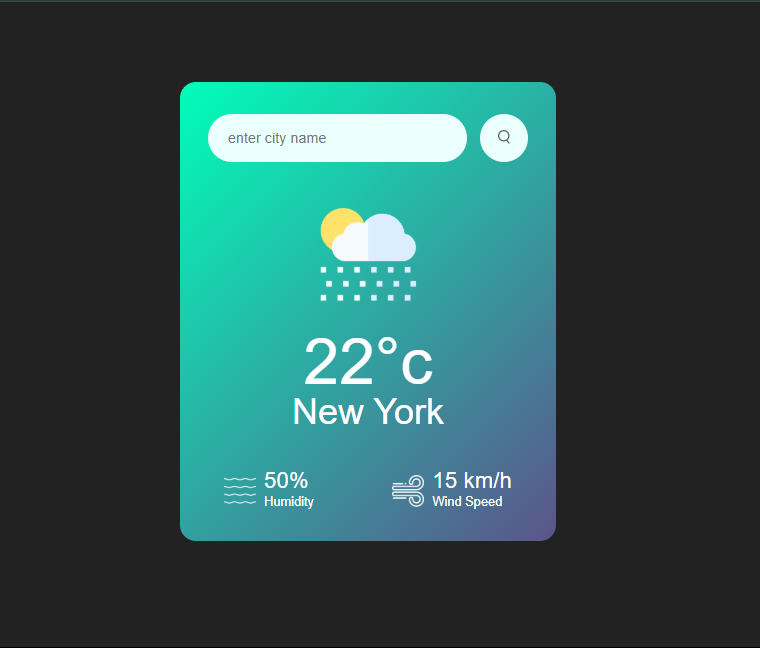

# Weather App 🌤️

A simple and elegant weather application that allows users to check real-time weather conditions for any city worldwide.



## Features ✨

- Real-time weather data using OpenWeatherMap API
- Display of current temperature in Celsius
- Humidity percentage indicator
- Wind speed information
- Dynamic weather icons based on current conditions
- Responsive design for all devices
- Simple and intuitive user interface

## Technologies Used 🛠️

- HTML5
- CSS3
- JavaScript (Async/Await)
- OpenWeatherMap API

## How to Use 🚀

1. Clone this repository:
```bash
git clone https://github.com/wendiblac/weather-app.git
```

2. Get your API key:
   - Sign up at [OpenWeatherMap](https://openweathermap.org/)
   - Generate an API key from your account dashboard
   - Replace the `apiKey` in the JavaScript code with your key

3. Open `index.html` in your browser

## Usage 💡

1. Enter the name of any city in the search box
2. Either click the search button or press Enter
3. View the current weather details:
   - Temperature in Celsius
   - City name
   - Humidity percentage
   - Wind speed
   - Weather condition icon

## Weather Conditions Icons 🎨

The app includes different icons for various weather conditions:
- ☀️ Clear sky
- ☁️ Clouds
- 🌧️ Rain
- 🌨️ Snow
- 🌫️ Mist
- 🌦️ Drizzle

## API Reference 📚

This project uses the [OpenWeatherMap API](https://openweathermap.org/api) to fetch weather data.

## Contributing 🤝

1. Fork the repository
2. Create your feature branch (`git checkout -b feature/AmazingFeature`)
3. Commit your changes (`git commit -m 'Add some AmazingFeature'`)
4. Push to the branch (`git push origin feature/AmazingFeature`)
5. Open a Pull Request

## License 📝

This project is licensed under the MIT License

## Acknowledgments 🙏

- Weather data provided by OpenWeatherMap
- Icons designed for weather conditions
- Built with ❤️ by [Wendiblac] 